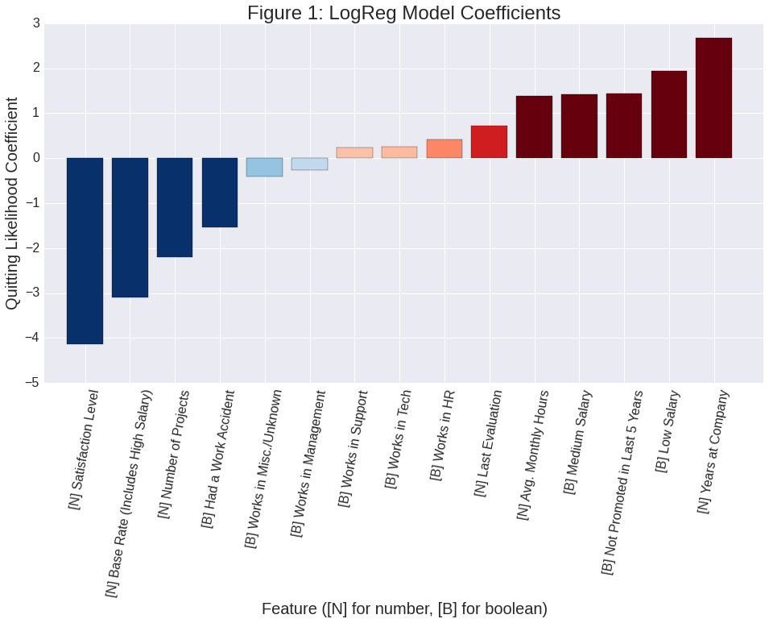

### Designing the Optimal Employee Experience (For Employers' Wallets)

##### Joey Maalouf

_Medium_, an online journal with a dedicated data science category, published an interesting dataset on _Kaggle_ about employee conditions and whether or not a given employee quit their job at that company[1]. It contains 15,000 responses with a variety of potentially useful fields, such as the employee's pay grade, number of projects, and average monthly hours.

The obvious thing to do, with access to all of these features and a categorical result variable, is to train a logistic regression model. With so many different categories, it's hard to really say what primarily drives an employee to quit their job; for that, we can look at the coefficient parameters of our trained model. We can discount any of the features with a p-value greater than 0.1; these are not necessarily statistically significant, and we don't want to risk coming to any false or unsupported conclusions.

Figure 1 shows the coefficients of the features in the logistic regression model that can be considered statistically significant, where negative values correspond to conditions in which employees tend to stay and positive values correspond to conditions that make employees want to leave. As we might have suspected, satisfaction level is _extremely_ important to keeping your employees, and the lower the pay grade, the more likely they are to leave. Additionally, a longer employment duration is a big indicator of quitting likelihood; however, this is almost certainly due to the tendency we have of transitioning between jobs over time until we retire.

It's quite interesting that employees are _less_ likely to leave a company if they've suffered a work accident in their time there; my theory is that they tend to receive a benefits package or something similar to convince them to stay as a happy worker and not sue the company. Also of note is the relatively small part the employee's department plays, especially when compared to "major events" like having a work accident or not being promoted. However, within the comparison between departments, human resources workers are most likely to leave, while management and miscellaneous employees are least likely to quit.

...

[1] [Human Resources Analytics: Why are our best and most experienced employees leaving prematurely?](https://www.kaggle.com/ludobenistant/hr-analytics)
 
[Notebook Source](https://github.com/joeylmaalouf/HR-analytics/blob/master/report/report3.ipynb)
